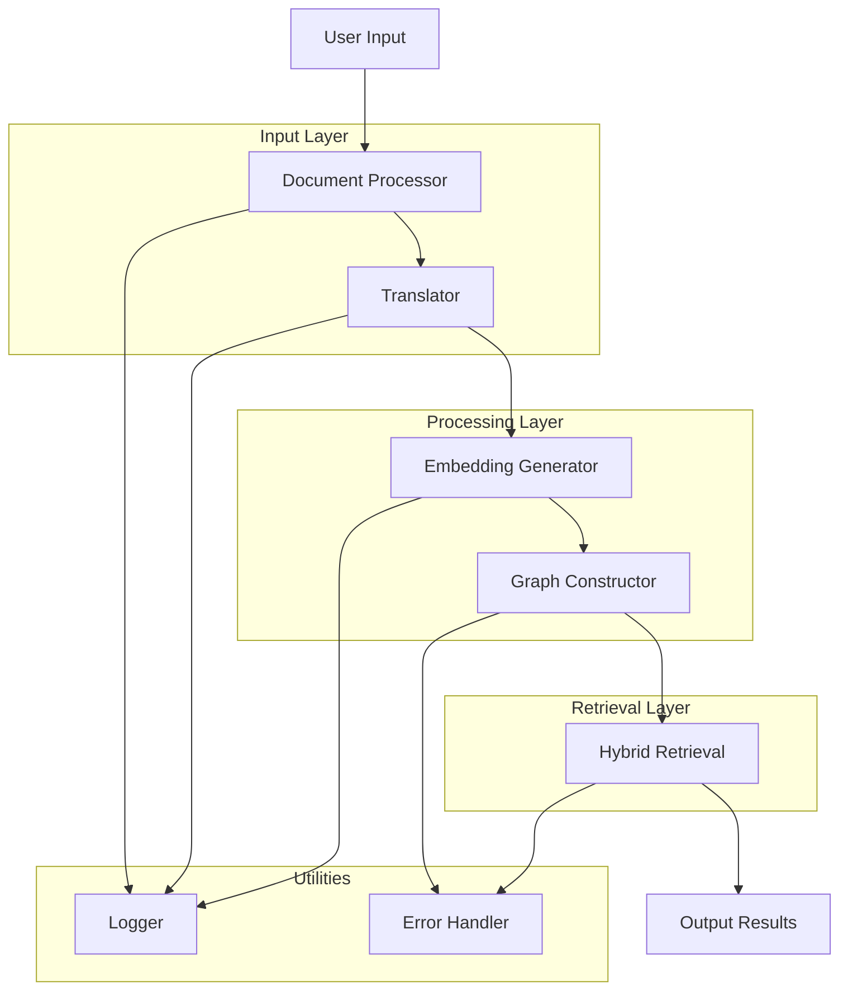

# System Flowchart Documentation

## Mermaid Diagram



## Converting to Image

To convert this Mermaid diagram to an image, follow these steps:

1. Copy the entire Mermaid code block above (including the ```mermaid and ``` lines).
2. Go to the Mermaid Live Editor: https://mermaid.live/
3. Paste the copied code into the left panel of the editor.
4. The diagram will be rendered in the right panel.
5. Click on the "Download SVG" button in the top right corner to save the diagram as an image.
6. Optionally, you can also download as PNG or PDF using the respective buttons.

After downloading the image, you can add it to this document or use it in other documentation as needed.