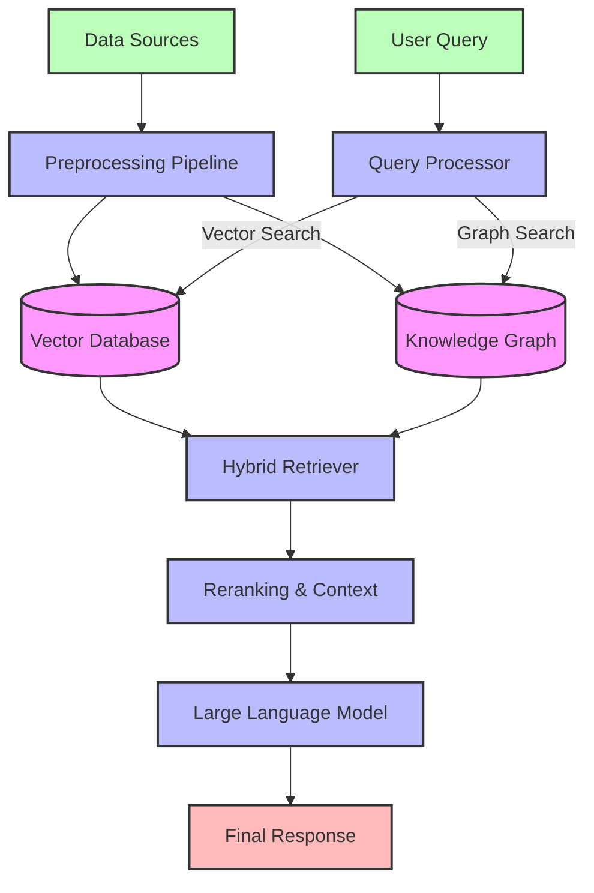

# Hybrid RAG System Architecture

## Component Description

1. **Data Sources**: Raw input data (documents, texts, structured data)
2. **Preprocessing Pipeline**: Handles document parsing, chunking, and embedding generation
3. **Vector Database**: Stores document embeddings for similarity search
4. **Knowledge Graph**: Stores semantic relationships between entities
5. **Query Processor**: Analyzes user queries and dispatches appropriate search strategies
6. **Hybrid Retriever**: Combines results from vector and graph-based searches
7. **Reranking & Context**: Prioritizes and formats retrieved information
8. **LLM**: Generates human-readable responses using retrieved context
